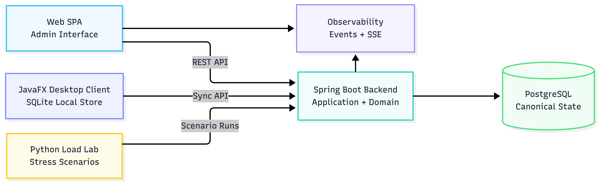
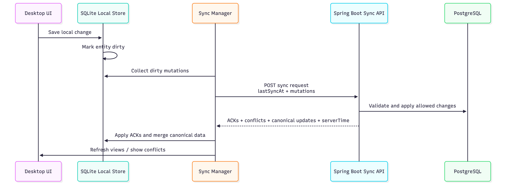

# RentIt+ Companion Repository

> Public showcase for the RentIt+ offline-first rental management platform.  
> The production/diploma monorepo remains private, while this repository documents the architecture, synchronization model, screenshots, selected diagrams, and extractable engineering ideas behind the system.

---

## What is RentIt+?

**RentIt+** is an offline-first rental and inventory management platform built as an HTL diploma project and portfolio system.

The original application is designed for environments where staff must continue working even when network connectivity is unstable or unavailable. Typical examples include front desks, storage rooms, warehouses, event-equipment rooms, and location-based lending workflows.

The private implementation combines:

| Component | Role |
|---|---|
| **Spring Boot backend** | Central authoritative API, business validation, sync endpoints, PostgreSQL persistence |
| **JavaFX desktop client** | Staff-facing offline client with local SQLite persistence |
| **Web SPA** | Browser-based admin and management interface |
| **Observability subsystem** | Live insight into sync events, HTTP activity, health, and domain errors |
| **Python load lab** | Stress-testing and scenario execution for backend and sync behavior |

This public companion repository does **not** contain the full private source code. Instead, it is intended to make the project understandable, reviewable, and useful as a technical portfolio artifact.

---

## Why this companion repository exists

The main RentIt+ repository contains the full diploma-project implementation, including internal code, thesis-specific work, private deployment details, and team-specific history.

This public repository exists to showcase the engineering work safely:

- Present the architecture without exposing the full private monorepo.
- Document the offline-first synchronization model.
- Explain the domain and persistence design.
- Share selected diagrams, screenshots, and technical write-ups.
- Extract reusable ideas such as sync contracts, observability concepts, and load-test scenarios.
- Provide a clean public reference for CVs, interviews, and portfolio discussions.

---

## Project Status

RentIt+ is under active development as a diploma and portfolio project.

The private implementation currently includes working versions of the core system areas:

- Product and category management
- Customer management
- Inventory management
- Orders and rental workflows
- Desktop offline persistence
- Sync endpoints and local sync managers
- Conflict tracking and conflict UI concepts
- PostgreSQL migrations with Flyway
- JavaFX desktop UI
- Web SPA administration interface
- Observability modules
- Load and stress testing utilities

Some ERP-style modules, such as deeper finance, maintenance planning, document processing, and advanced reservation scheduling, are treated as future extensions rather than the core diploma scope.

---

## Architecture at a Glance

RentIt+ follows a **modular monolith** approach with clear internal boundaries.

The backend is structured around **hexagonal architecture**, also known as **ports and adapters**:

```text
UI / REST / Sync Controllers
        |
        v
Application Services
        |
        v
Domain Ports and Use Cases
        |
        v
Shared Domain Model
```

Infrastructure concerns are pushed outward into adapters:

```text
Persistence Adapter  -> PostgreSQL / JPA
Web Adapter          -> REST API / Sync API
Desktop Adapter      -> JavaFX / SQLite / HTTP Sync Client
Observability Adapter -> SSE / Logs / Metrics-like event stream
```

The goal is to keep business logic independent from frameworks and infrastructure decisions.

---

## High-Level System View




---

## Core Design Ideas

### 1. Offline-first desktop workflow

The desktop client is not just a thin online UI. It can continue working locally using SQLite.

Local operations are stored first and synchronized later. This allows staff to perform operational tasks even when the central server is unreachable.

### 2. Server-authoritative synchronization

The server remains the canonical source of truth. Desktop clients submit structured sync requests containing local mutations and their last known sync cursor.

The backend validates, applies, rejects, or classifies these mutations, then returns acknowledgements, conflicts, canonical updates, and a new server time/cursor.

### 3. Location-aware operation

RentIt+ models inventory and workflow state around physical locations. Desktop devices are registered to a location, and sync requests carry location context so that local work remains scoped to the correct operational boundary.

### 4. Append-only inventory ledger

Inventory changes are represented as ledger-style transactions rather than only final stock snapshots. This makes stock movement easier to explain, audit, and reconcile.

### 5. Separation between planning and execution

The system separates preparation-oriented workflows, such as orders or future reservations, from actual rental execution, such as checkout, return, partial return, and finalization.

---
## Offline Sync Concept

A simplified sync round looks like this:



The important point is that the client sends **intent**, not just raw table changes. The server decides what can safely become canonical.
---

## Main Functional Areas

| Area | Description |
|---|---|
| **Catalog** | Products, categories, pooled products, serialized products |
| **Inventory** | Location-aware stock, product units, inventory ledger, balance snapshots |
| **Customers** | Customer records, status, search and filtering |
| **Rentals** | Checkout, rental lines, partial return, full return, finalization |
| **Orders** | Preparation and order-building workflows for incoming or planned stock |
| **Devices** | Desktop client registration and location binding |
| **Sync** | Product, category, customer, rental, inventory, order, and device sync contracts |
| **Observability** | Live events, HTTP activity, sync analytics, domain errors, health views |
| **Load Lab** | Scenario-based stress testing for realistic system behavior |

---

## Technology Stack

| Layer | Technologies |
|---|---|
| Backend | Java 21, Spring Boot, Gradle, Spring Web, Spring Security, JPA/Hibernate |
| Database | PostgreSQL, Flyway |
| Desktop | JavaFX, SQLite, Java HTTP Client |
| Web SPA | Vue 3, Vite, Pinia, Vue Router |
| Testing / Lab | Python scenario runner, backend tests, sync stress scenarios |
| DevOps | Docker Compose, GitHub/GitLab-style CI ideas, release packaging |
| Architecture | DDD-inspired design, hexagonal architecture, modular monolith, JPMS boundaries |

---

## What is public here?

This repository may contain public-safe artifacts such as:

```text
.
├── README.md
├── docs/
│   ├── architecture/
│   ├── sync/
│   ├── domain-model/
│   ├── observability/
│   └── load-lab/
├── diagrams/
├── screenshots/
├── samples/
│   ├── sync-contracts/
│   ├── load-lab-scenarios/
│   └── observability-events/
└── notes/
```

The exact contents may evolve over time. The goal is not to mirror the private repository, but to explain and demonstrate the most interesting parts of the system.

---

## What is intentionally not public?

The following are intentionally excluded from this companion repository:

- Full private monorepo source code
- Private deployment configuration
- Real environment variables or credentials
- Internal Git history
- Sensitive diploma-project coordination material
- Full thesis drafts before submission
- Production database dumps
- Private test data

---

## Suggested Reading Path

If you are reviewing RentIt+ as a portfolio project, a good path is:

1. Start with this README.
2. Open the architecture overview in `docs/architecture/`.
3. Review the sync model in `docs/sync/`.
4. Look at screenshots or diagrams in `screenshots/` and `diagrams/`.
5. Review selected sample contracts in `samples/`.
6. Read the load-lab notes to see how the system was stress-tested.

---

## Portfolio Highlights

RentIt+ demonstrates practical experience with:

- Designing a non-trivial full-stack system
- Building a Spring Boot backend with clear application boundaries
- Modeling a real business domain with products, customers, inventory, orders, and rentals
- Implementing offline-first workflows with local persistence
- Designing synchronization contracts and conflict handling
- Using PostgreSQL as a central canonical data store
- Using SQLite for embedded desktop persistence
- Building a JavaFX desktop application
- Building a modern web administration interface
- Adding observability for live system behavior
- Thinking about deployment, packaging, testing, and stress scenarios

---

## Current Focus

The current focus of the public companion repository is documentation and demonstration:

- Clean architecture explanation
- Sync protocol explanation
- Diagrams and screenshots
- Public-safe samples
- Load-testing write-ups
- Extractable engineering patterns

Future additions may include small standalone demo modules or simplified reference implementations of selected subsystems.

---

## License

This companion repository is provided for portfolio and educational purposes.

The license may differ from the private implementation. Until a formal license is added, please treat the contents as **all rights reserved**.

---

## Authors

**Brian Rono**  
**Babak Nourbakhsh**

HTL Diploma Project / Full-Stack Software Engineering Portfolio

---

## Tagline

**RentIt+ — reliable rental management, even when the network is not.**
